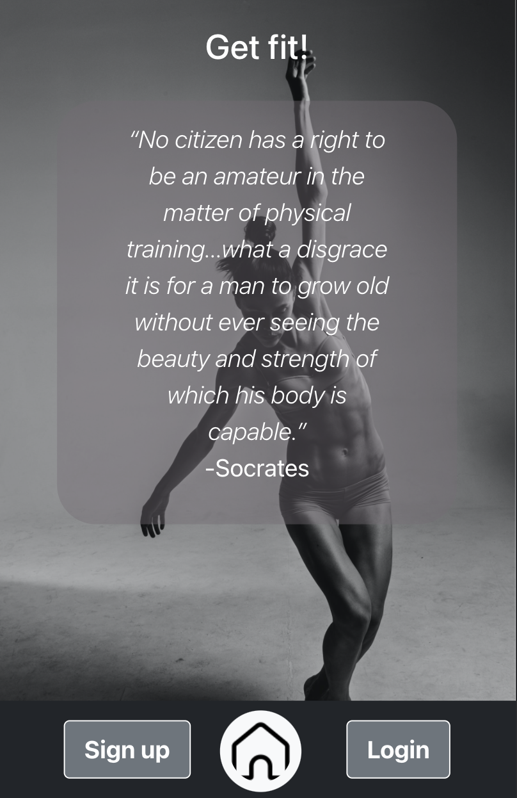
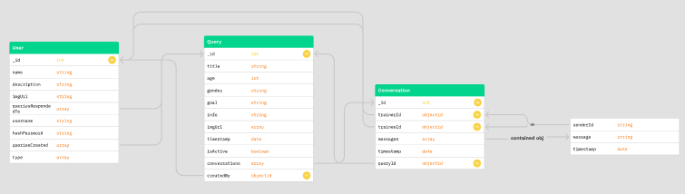
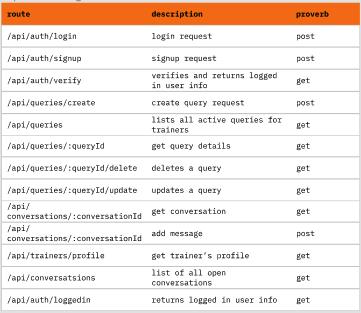

# GET FIT! (Ironhack-project-3)

This app is for all the heroes out there... the teachers, the plumbers, the women, the men, the engineers... But don't just be a hero... Look like one!

Post your fitness needs anonymously, and receive offers from the personal trainers on the platform. Connect and start training!!!

Try all that and more on https://get-fit-app.netlify.app.

## Motivation

This project was done as part of the Ironhack full time web development bootcamp. It is the third and last out of three main projects required to finish the bootcamp. The reason for choosing this theme, is because fitness should be part of everyone's life. This app helps everyone find the right personal trainer to help them achieve their fitness goals.

## Features

This app has two types of users: Trainees and Trainers.

### For Trainees:

1. Create an anonymous query with your fitness needs
2. Receive offers from trainers
3. See profiles of trainers you have received offers from
4. Chat with the trainers and connect with the ones that meet your needs

### For Trainers:

1. Create a profile that can be seen by users you make offers to
2. Find and reply to user queries
3. Chat with users and turn them into clients

## User stories

The project can be divided in 2 sections for each type of users. Below you can see a sample of the initial backlog:

- **All users**
1. As a user role I need to input my username in a form input field and input a valid password to log in
2. As a user role I need to click a button to log out of my cookbook (logout)
3. As a user role I need to input a valid username and password to create an account (sign up)

- **Trainee**
1. As a trainee role I need to fill in specific information about a query and press ‘create’  to create new query
2. As a trainee role I would like to click on ‘Queries’ and see the list of all queries
3. As a trainee role I want to click on a ‘Query’ to see details of that recipe
4. As a trainee role I need to click on ‘edit’ to  edit an existing query in my and click ‘save’ to save changes and return to the list of all my queries
5. As a trainee role I want to press ‘delete’ to remove a query I have created
6. As a trainee role I want to receive offers from trainers and be able to reply to them
7. As a trainee role I would like to see the trainer profiles from the offers received
8. As a trainee role I would like to see a list of all converation offers I have received

- **Trainer**
1. As a trainer role I want to be able to see a list of all queries created by users when clicking on ‘Queries’
2. As a trainer role I want to create a profile that can bee seen by users I make offers to
3. As a trainer role I would like to see query details and when i click on reply, to start a chat with the user
4. As a trainer role I would like to see a list of all converation offers I have sent

- **Foundation**
1. Github repo (create all folders and files)
2. layout: navbar footer etc.
3. ironlauncher
4. react create app

## Future features

- Testing and potential bugfixing
- Add pagination and sorting to routes
- Improve chat functionality
- Edit and delete trainer profile
- Implement Passport and add login with social media or phone number
- Query expiration after 48 hours

## Models

## Server routes table

## Build status

The website hasn't undergone a lot of testing so it might contain some bugs. Routes can be further secured to avoid oversharing data.

## Frameworks, libraries and technologies used

- Built using Node.js and Express.js
- Bcrypt to support with authentication
- Cloudinary to host the recipe images
- Database: MongoDB for local testing, and Mongo Atlas for production
- Git for distributed version control, and GitHub for source code management and hosting
- Heroku for hosting the backend of the application

## Special thanks

Thanks to [Raymond](https://github.com/RaymondMaroun) and [Joana](https://github.com/jofariaironhack) for their guidance and support throughout the bootcamp and this project.

## Created by
[Mohammed Chakmakchi](https://github.com/MohammedCh).